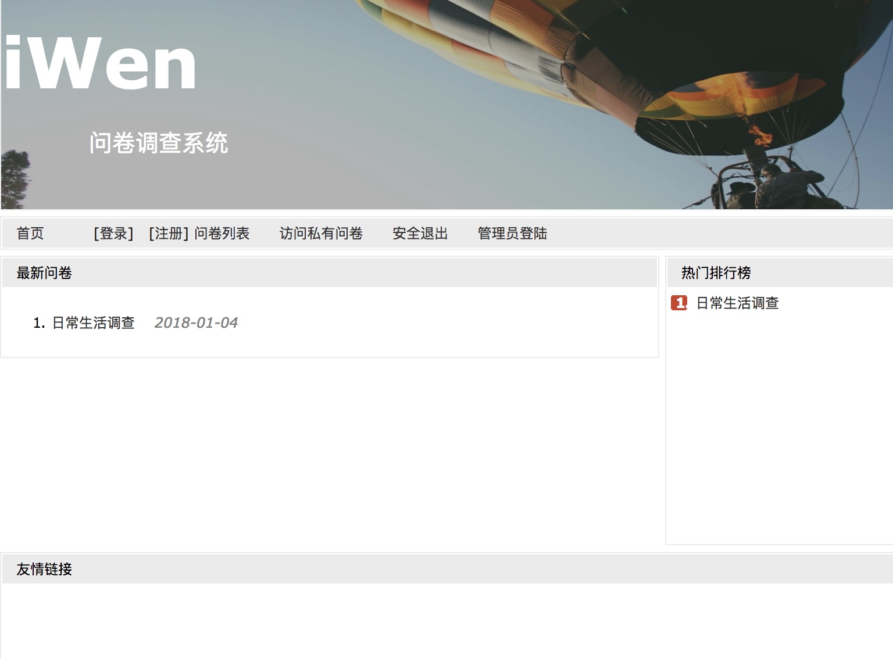
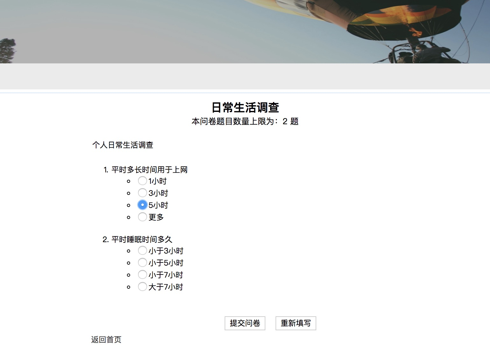
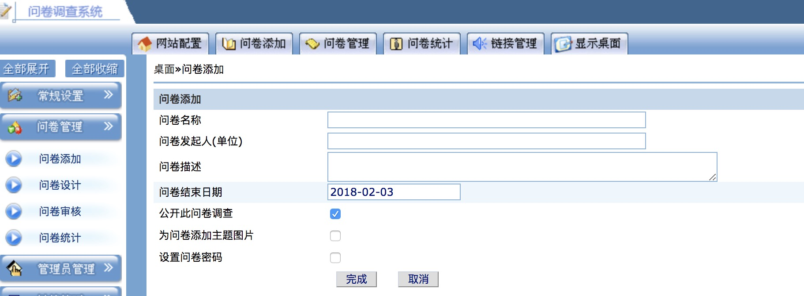
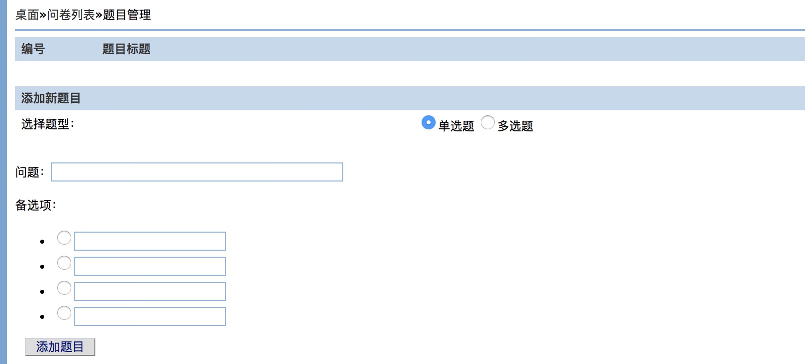
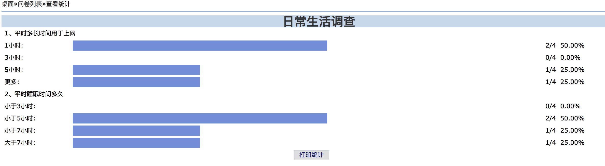

# Survey
iWen问卷调查系统  

项目部署   

------------------------------------    

项目环境：jdk1.8 
#### 1、打开eclipse，将项目导入。  

　　导入步骤1、File->import->General->Existing projects into Worksapce->选择项目的根目录  

#### 2、配置数据库  

　　打开数据库软件Navicat for Mysql，创建数据库，数据库名为survey
　　创建好之后，点击数据库，->点击查询->创建查询，将调查问卷目录下的sql文件，用编辑器打开，将其内容复制到刚才的创建查询中，
点击运行，数据库就创建好了。  

#### 3、运行项目。若自己的eclipse中，已经配置了tomcat服务器。  

　　直接将项目运行在已有的服务器上，即可。若未配置，见步骤4。
若服务器端口自己改了，就用自己改的端口，否则默认8080
　　在浏览器中访问http://localhost:8080/survey/index.jsp即可。  

#### 4、配置tomcat服务器。  

　　在eclipse中点击Windows->preferences->server->Runtime Environment
　　点击右边的Add按钮进行添加一个服务器。选择tomcat7，然后next，选择tomcat的根目录

### 项目展示 
#### 项目运行之后，前台页面如下  

#### 对应的调查填写页面如下

#### 项目管理后台如下,主要包括问卷管理模块、用户管理模块等

#### 问卷添加,分为单选题和多选题

#### 问卷列表展示

#### 问卷调查结果可视化统计

注：要获得sql请扫描下方，这是对我付出的一种小回报，谢谢。如果项目有问题，我会帮助你跑通。之后加我QQ：1106002609，即可。  

